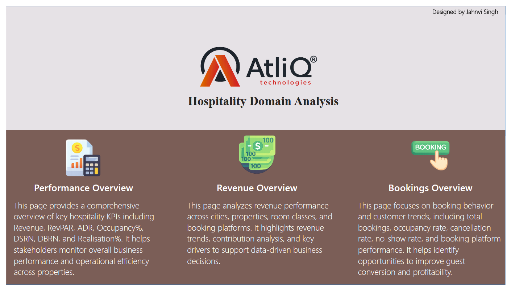
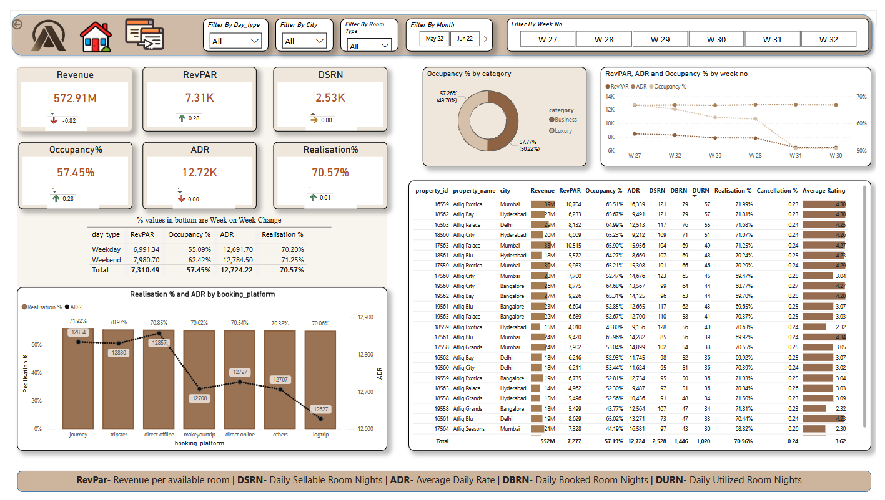
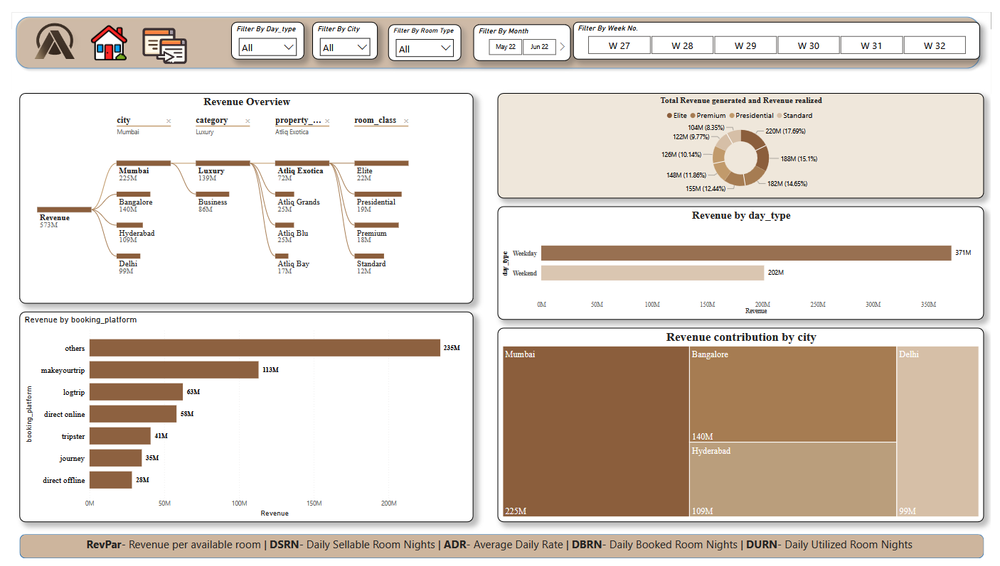
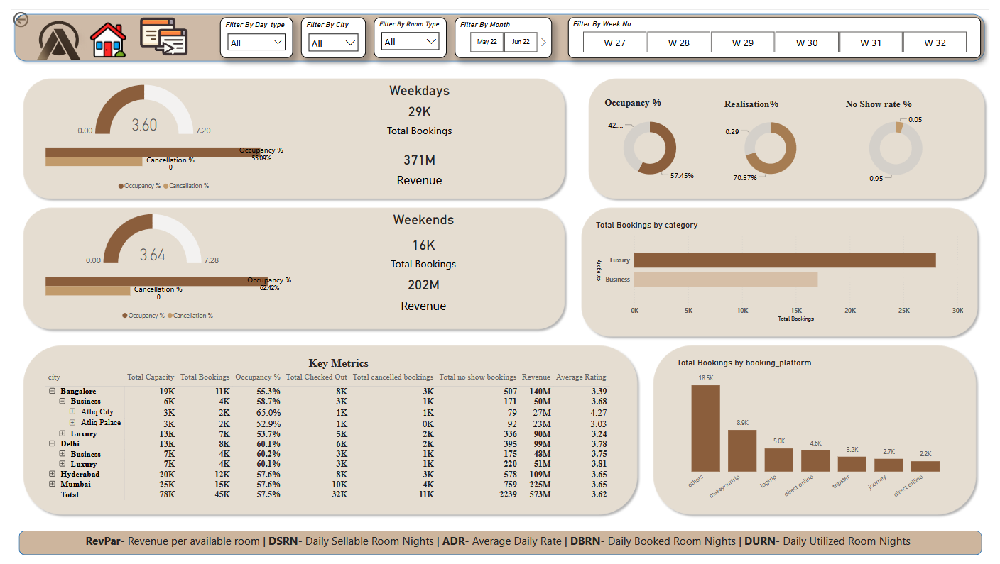

# Hospitality-Analytics-Dashboard-PowerBI
An end-to-end Hospitality Analytics Dashboard developed in Power BI using Excel, DAX, Power Query, Data Modeling, Bookmarks and Page Navigation to deliver actionable business insights.

## Project Overview

This project showcases an end-to-end Hospitality Analytics Dashboard developed in **Power BI** for the fictional hotel chain **AtliQ Grands**. The objective was to analyze hotel performance across multiple cities and provide actionable business insights to support strategic decision-making.

The dashboard leverages **Excel datasets**, **Power Query**, **DAX**, **Data Modeling**, **Bookmarks**, and **Interactive Page Navigation** to deliver a comprehensive business intelligence solution.

---

## Problem Statement

AtliQ Grands is a luxury hotel chain operating across major Indian cities, including Mumbai, Delhi, Hyderabad, and Bangalore. Due to increasing competition and ineffective management decisions, the company has experienced a decline in market share and revenue.

As a Data Analyst, the objective was to analyze historical booking and revenue data, build interactive dashboards, and provide insights that help management improve revenue, occupancy, and operational performance.

---

## Objectives

* Analyze hotel performance across multiple cities and properties.
* Build interactive dashboards for business stakeholders.
* Track key hospitality KPIs.
* Identify revenue trends and booking patterns.
* Provide actionable business insights for decision-making.

---

## Dashboard Pages

### Landing Page

* Interactive navigation using bookmarks
* Custom page navigation
* Business-focused dashboard overview

### Performance Overview

* Revenue
* RevPAR
* ADR
* DSRN
* Occupancy %
* Realisation %
* Weekly performance trends

### Revenue Analysis

* Revenue by City
* Revenue by Property
* Revenue by Room Class
* Revenue by Booking Platform
* Revenue Contribution Analysis

### Booking Analysis

* Weekday vs Weekend Performance
* Occupancy Rate
* Cancellation Rate
* No Show Rate
* Booking Platform Analysis
* Booking Category Analysis

---

## Key KPIs

* Revenue
* RevPAR (Revenue Per Available Room)
* ADR (Average Daily Rate)
* Occupancy %
* Realisation %
* DSRN
* DBRN
* Cancellation %
* No Show %

---

## Tech Stack

* Power BI Desktop
* Microsoft Excel
* Power Query
* DAX
* Data Modeling (Star Schema)
* Bookmarks
* Page Navigation
* Interactive Visualizations

---

## Key Business Insights

* Mumbai generated the highest revenue among all cities.
* Luxury hotels contributed the highest share of total revenue.
* Weekday bookings generated higher revenue compared to weekends.
* Booking platforms showed varying performance, highlighting optimization opportunities.
* Revenue and occupancy trends varied across hotel properties, enabling targeted business decisions.

---
## Dashboard Preview

### Landing Page

### Performance Overview

### Revenue Analysis

### Booking Analysis

---

## Project Files

📄 **Dashboard PDF:** [Hospitality_Analytics_Dashboard.pdf](Hospitality_Analytics_Dashboard.pdf)

📊 **Power BI File:** [Hospitality_Analytics.pbix](Hospitality_Analytics.pbix)

---

## Dataset

The dashboard is built using the **AtliQ Grands hospitality dataset**, which includes booking transactions, hotel information, room details, and date dimensions used for revenue, occupancy, and performance analysis.

---

